# mswd
一、解决什么需求

	自己收集的社工信息怎么存储？
	
	每次收集到的数据结构都不同怎么办？
	
	这次收集的数据想和以前收集的数据产生关联该如何处理？
	
	查询数据的时候如何快速有效的获取？
	
	爆破需要字典怎么提取？
	
	数据再次利用怎么合并导出？
	
	
二、使用前准备
	根据自己情况修改本地的db名称，以及默认关联字段（该处值可手动清空，在运行中手动输入）。
	参数设定

	通过14行设定默认db的名称
	通过19行设定数据关联的字段

三、支持的文件格式
	txt、csv
	文件首行为字段定义行
	文件内每行内以逗号相隔
	如下：
txt文件
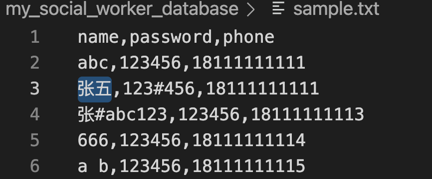
csv文件
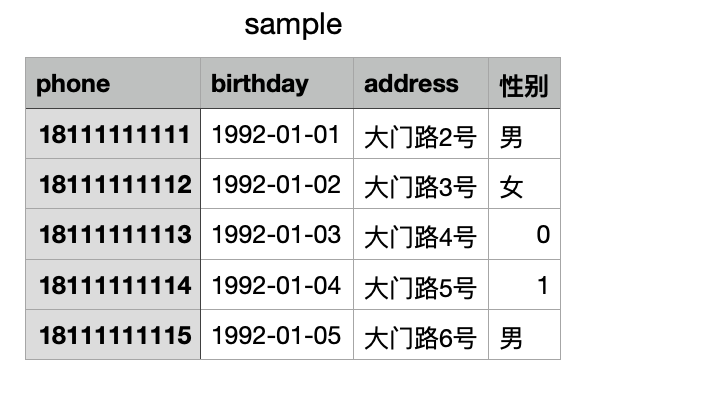

		

四、功能介绍
	运行命令
	python3 mswd.py
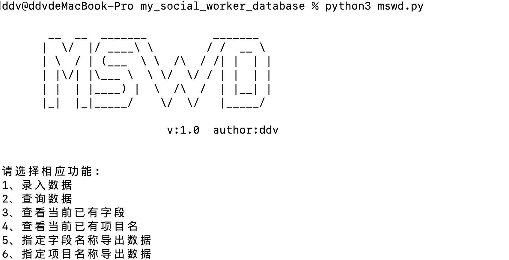
根据提示一步步向下运行即可

	1、录入数据
第一批数据：导入txt文件的数据，共有3列数据，首行为字段定义行分别为：name,password,phone
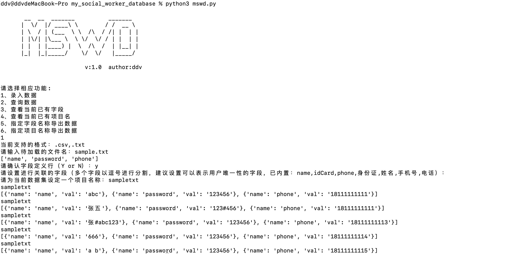

第二批数据：导入csv文件的数据，共有4列数据，首行为字段定义行分别为：phone,birthday,address,性别。
通过设定关联字段phone，使当前数据与第一批数据进行关联。

两波数据的关联字段为phone

	2、查询数据
通过设定的关联字段phone进行查询
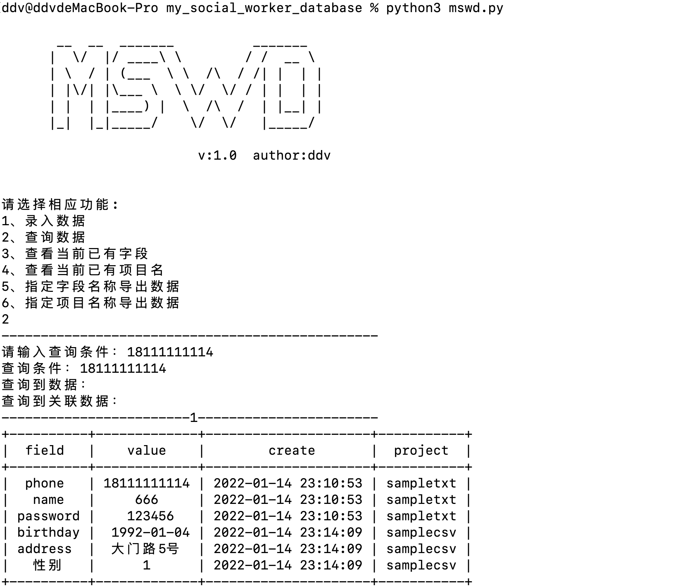
可见通过18111111114查询到关联数据。

通过其他字段进行查询，可见因为phone的关联，使用第二批非关联字段值进行查询也能查询到第一批的数据
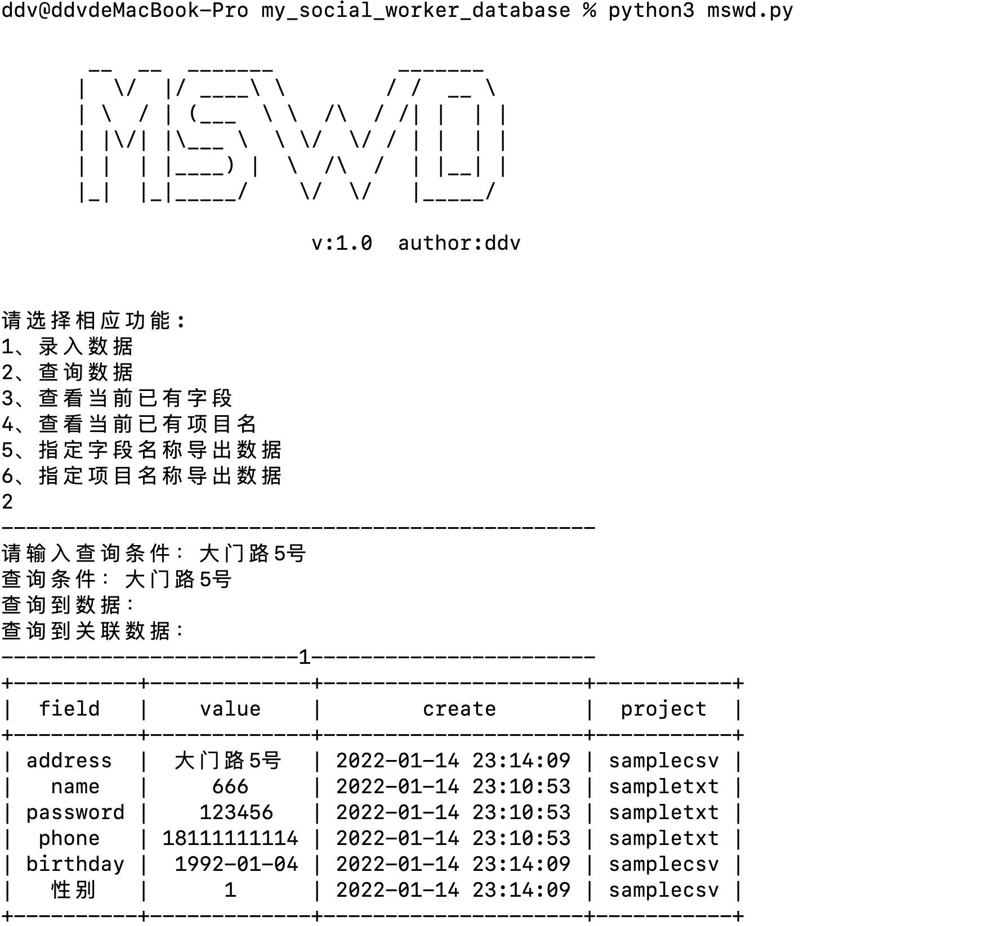
可见通过大门路5号也能查询到相同的关联数据

	3、查看当前已有字段
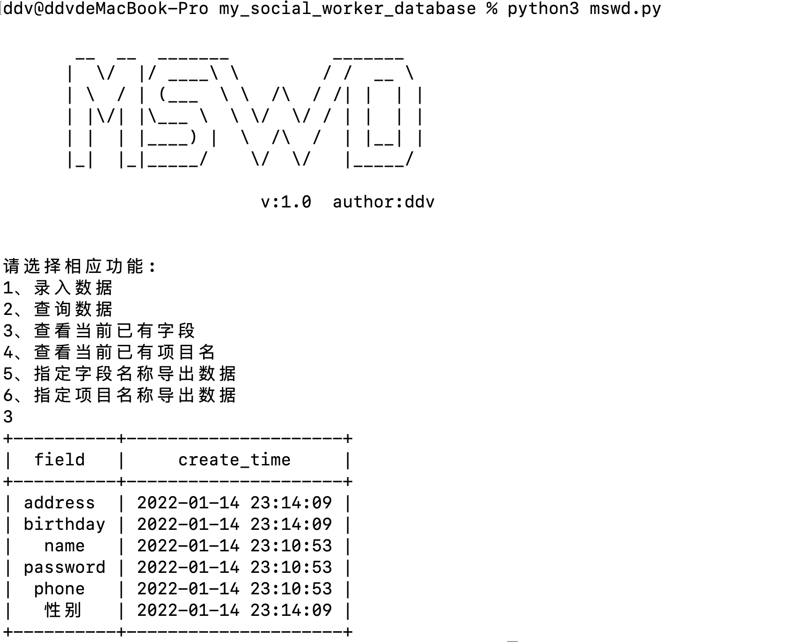

	4、查看当前已有项目名
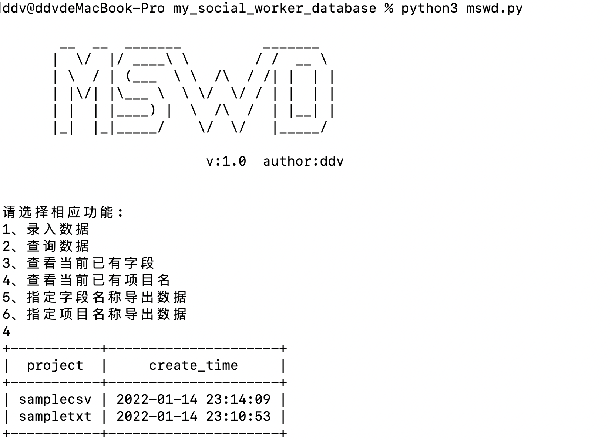

	5、指定字段名称导出数据
指定phone,name,password导出数据形成字典，其中首个字段将作为关联字段获取数据

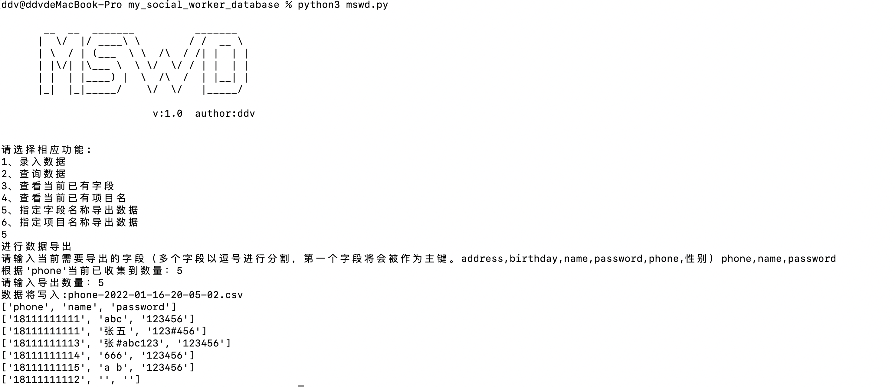
数据文件名为：首个字段名-导出时间.csv

可见18111111111具有关联的数据为两条,18111111112没有关联name和passwrod

	6、指定项目名称导出数据
导出第二批的数据
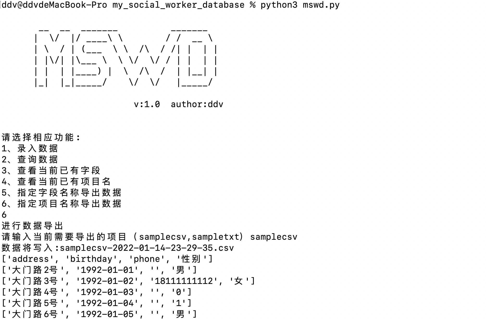
数据文件名为：项目名-导出时间.csv
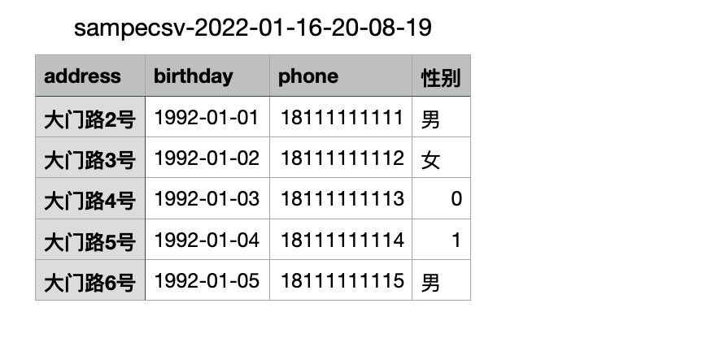

五、注意事项
	1、当前导入的数据文件格式支持.txt和.csv
	2、文件的首行需要设定字段定义（当前列的名称）
	

备注：（经过实战mswd工具在原文件有几十G，处理到db后会有上百G的文件大小，且在进行模糊查询的时候性能很低。因而诞生了https://github.com/ddv404/file_content_saerch/tree/main。）
