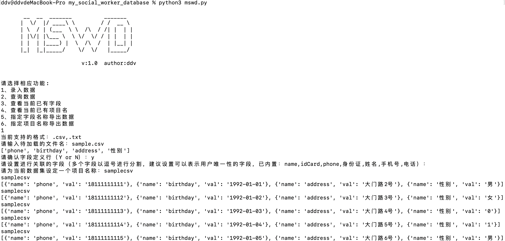

# mswd
一、解决什么需要
	阶段性不定期存储不同结构的数据，且不同批次的数据之间可能存在关联性。查询时可通过单个字段值查询到所有关联数据。可通过指定字段值导出数据行形成字典。可通过指定批次名称导出数据。

二、如何使用
	1、参数设定

	通过14行设定默认db的名称
	通过19行设定数据关联的字段
	2、运行命令
	python3 mswd.py

根据提示一步步向下运行
	2、录入数据
导入第一波数据

导入具有关联性的数据，关联字段为phone

两波数据的关联字段为phone

	3、查询数据

可见通过18111111114查询到关联数据

可见通过大门路5号也能查询到相同的关联数据

	4、查看当前已有字段

	5、查看当前已有项目名

	6、指定字段名称导出数据
指定phone,name,password导出数据形成字典，其中首个字段将作为关联字段获取数据

数据文件名为：首个字段名-导出时间.csv

可见18111111111具有关联的数据为两条

	7、指定项目名称导出数据

数据文件名为：项目名-导出时间.csv

三、注意事项
	1、当前导入的数据文件格式支持.txt和.csv
	2、文件的首行需要设定字段定义（当前列的名称）
	
